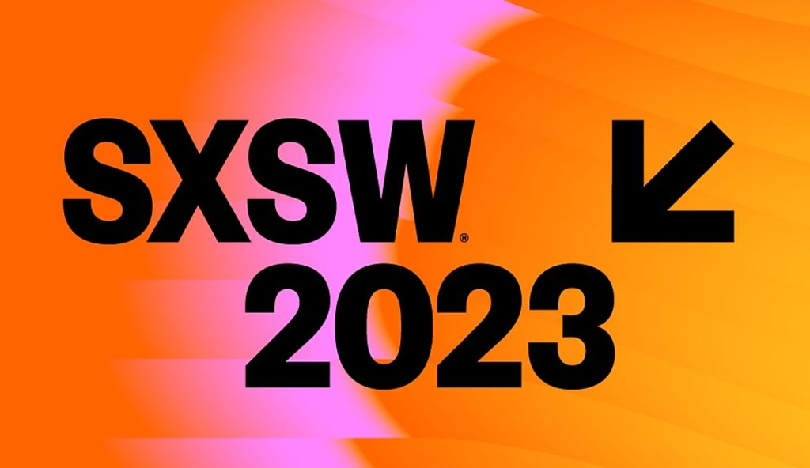

# Twitter Sentiment Analysis

**Authors**: JF Roberts, Aung Si & Michael Romanski

<p align="center">
  
</p>

## Overview

Our data analytics firm, Flatiron Analytics, has been hired by [SXSW](https://www.sxsw.com/) to perform sentiment analysis on tweets from the festival. This project analyses a data set crowdsourced by festival goers to assess positive or negative emotions towards Apple and Google products. Based on our analysis results, we will identify which product brand has the most positive association amongst festival goers.

## Business Understanding

SXSW wants to develop a new app for their festival and is deciding whether to deploy it on the Apple Store or Google Play Store. Flatiron Analytics has been tasked with developing a predictive model to accurately identify whether a given tweet displays “positive,” “negative,” or “neutral” emotion towards Apple and Google devices. Our analysis will provide SXSW with a clear direction on which Store to deploy their new app and how to utilize our predictive models for future festivals.
 

## The Data

<p align="center">
  
</p>

Our analysis data was pulled from [Data World](https://data.world/crowdflower/brands-and-product-emotions) and included 8,700 tweets from the 2011 SXSW festival. Sentiments for each tweet were crowd-sourced where:

“The crowd was asked if the tweet expressed positive, negative, or no emotion towards a brand and/or product.”

The data set includes information about the text of each tweet, the product the tweet is directed at, and the emotion towards that product.


## Data Processing.

An essential step in any NLP project is to process the text, whittling it down to its essential components. We achieved this by dropping irrelevant characters often found in tweets such as hashtags ‘#’, the ‘@‘ symbol, and any numbers. 

There was an evident class imbalance where over 60% of our tweets were identified as “neutral” sentiments. After further analysis of these neutral tweets, we also noticed that many of them were misrepresented as such and would have been more accurately identified as positive or negative sentiments. As a result, we dropped the neutral sentiments altogether.

## Evaluation Metric

It’s often the case, in a business problem, that we focus on either minimizing false negatives or false positives. 

In this case, there’s no distinction between the two. For example, a positive tweet classified as a negative holds no more value to our business problem than a negative tweet classified as a positive. Because of this, we chose accuracy as our evaluation metric. Accuracy, in this case, is how well our model predicts the actual sentiment of a tweet.


## Models


## Feature Importances


## Recommendations 


1. **Apple over Google** - 

2. **Use our predictive model to classify sentiments from future festivals** - 

3. **Compare our predictive model to the crowd-sourced approach** - 

## Next Steps

1. We would like to source more reliable data and a larger data set. Hundreds of thousands of people attend the SXSW festival therefore, a larger and more representative data set would help our predictive model.

2. As noted above, many of our “neutral” sentiments were misrepresented. We want to conduct further analysis to better classify the neutral class. By doing so, we could develop a reliable multi-class predictive model rather than just a binary model.

3. Lastly, to get even more granular, we noticed that some tweets displayed both positive and negative sentiments towards the respective brands. Much like for the misrepresented “neutral” tweets, we would like to develop a more accurate way to handle these tweets.

## Repository Structure

```
├── data
├── notebook.ipynb
├── working_notebooks
├── images
├── .gitignore
├── README.md
└── presentation.pdf
```
