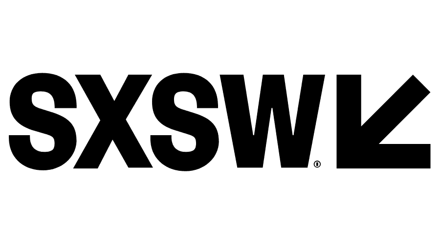
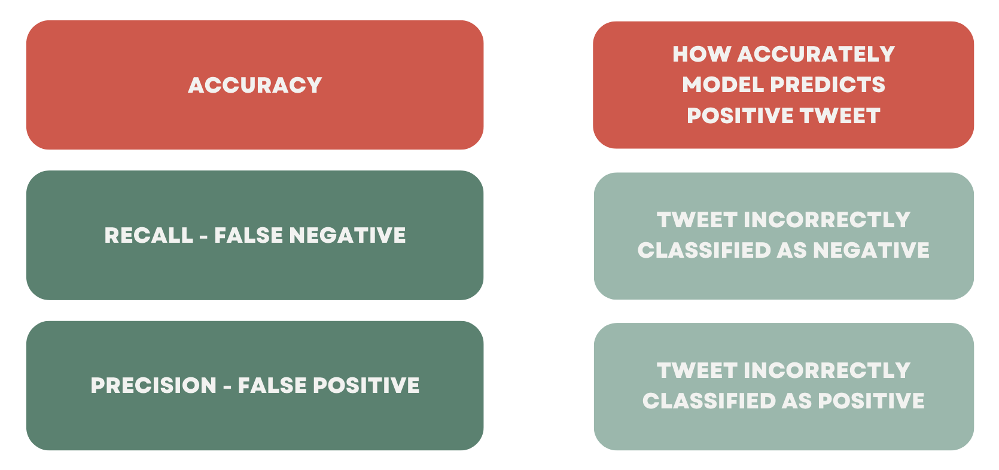
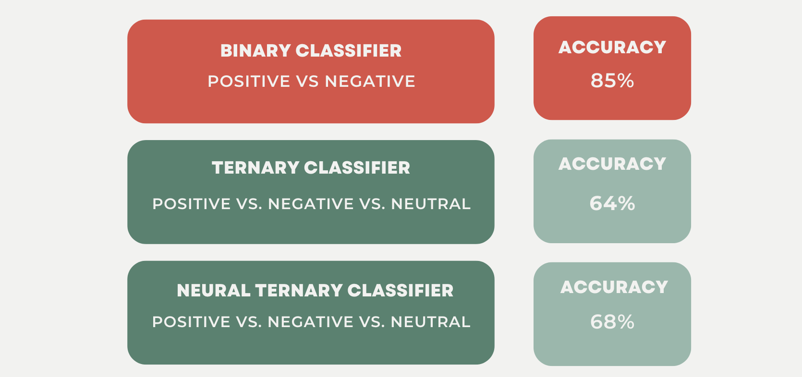
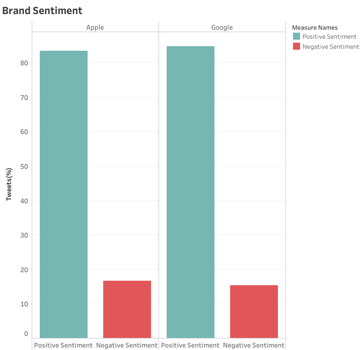

# Twitter Sentiment Analysis

**Authors**: JF Roberts, Aung Si & Michael Romanski

<p align="center">
  
</p>

## Overview

Our data analytics firm, Flatiron Analytics, has been hired by [SXSW](https://www.sxsw.com/) to perform sentiment analysis on tweets from the festival. This project analyses a data set crowdsourced by festival goers to assess positive or negative emotions towards Apple and Google products. Based on our analysis results, we will identify which product brand has the most positive association amongst festival goers.

## Business Understanding

SXSW wants to develop a new app for their festival and is deciding whether to deploy it on the Apple Store or Google Play Store. Flatiron Analytics has been tasked with developing a predictive model to accurately identify whether a given tweet displays “positive,” “negative,” or “neutral” emotion towards Apple and Google devices. Our analysis will provide SXSW with a clear direction on which Store to deploy their new app and how to utilize our predictive models for future festivals.
 

## The Data

<p align="left">
  
</p>

Our analysis data was pulled from [Data World](https://data.world/crowdflower/brands-and-product-emotions) and included 9,000 tweets from the 2011 SXSW festival. Sentiments for each tweet were crowd-sourced where:

“The crowd was asked if the tweet expressed positive, negative, or no emotion towards a brand and/or product.”

The data set includes information about the text of each tweet, the product the tweet is directed at, and the emotion towards that product.


## Data Processing

An essential step in any NLP project is to process the text, whittling it down to its essential components. We achieved this by dropping irrelevant characters often found in tweets such as hashtags ‘#’, the ‘@‘ symbol, and any numbers. 

There was an evident class imbalance where over 60% of our tweets were identified as “neutral” sentiments. After further analysis of these neutral tweets, we also noticed that many of them were misrepresented as such and would have been more accurately identified as positive or negative sentiments. As a result, we dropped the neutral sentiments altogether.

## Evaluation Metric

It’s often the case, in a business problem, that we focus on either minimizing false negatives or false positives. 

In this case, there’s no distinction between the two. For example, a positive tweet classified as a negative holds no more value to our business problem than a negative tweet classified as a positive. Because of this, we chose accuracy as our evaluation metric. Accuracy, in this case, is how well our model predicts the actual sentiment of a tweet.

<p align="left">
  
</p>

## Models
We trained the data on multiple predictive models with many different iterations. Ultimately, our Binary classifier(Random Forest Classifier) performed the best, predicting tweet sentiment with an Accuracy score of 85%. This model only looked at tweets that were marked as having a positive or negative emotion in them. Our Ternary and Neural Ternary Classifiers included tweets that were marked as neutral or having no sentiment. The addition of this made it much more difficult for these models to accurately predict which class a tweet belonged to.

<p align="left">
  
</p>

## Feature Importances
We extracted the top 20 Feature Importances from our Binary Classifier model. Since our data is text strings, the feature importances in this model are individual words. When looking at the top 20 words, there are quite a few that have a  strong connotation. Some of our most important words, such as fail, suck, fascist, and headache, elicit a clear negative connotation. It's these words that our model most heavily relies on to make predictions when given text data. Interestingly enough, there appear to be far fewer words in our top 20 that elicit positive connotation, and even those that do could be utilized in a way that would be viewed as negative. Examples of these words in our list are care and design. 


## Recommendations 
Since the data consists of positive and negative tweets about Apple and Google, we wanted to compare the overall sentiment by brand. We calculated the percentage of positive negative tweets for both brands, and discovered that the positive and negative sentiment scores were nearly identical. However, tweets about Apple (2337 total in our binary data) constituted nearly 3 times that of Google(854 total in our binary data). 

<p align="left">
  
</p>

1. **Apple over Google** - 
Based on what our brand sentiment graph tells us, we recommend a partnership with Apple. SXSW should spend more money and resources developing an optimized app on iOS since it is a larger audience than Android. Promotions run on the app like deals on products at the Apple pop-up stores, and exclusive or primary access to events with key-note speakers from Apple could all be beneficial to the popularity of the SXSW app.
2. **Use our predictive model to classify sentiments from future festivals** - 
Additionally, we recommend using our Binary Classifier model on next year's data to calculate the change in Apple sentiment from our 2011 data. If the above recommendation is taken, we expect to see an increase in positive sentiment towards Apple, and by extension the sentiment of the SXSW app on iOS.
3. **Compare our predictive model to the crowd-sourced approach** - 
Finally, we recommend comparing our model's predictions to newly gathered crowd sourced predictions and see how they differ. Our model would need to be fed only the data that was collected during the new round of crowd-sourced predictions in order to properly compare the two approaches.

## Next Steps

1. We would like to source more reliable data and a larger data set. Hundreds of thousands of people attend the SXSW festival therefore, a larger and more representative data set would help our predictive model.

2. As noted above, many of our “neutral” sentiments were misrepresented. We want to conduct further analysis to better classify the neutral class. By doing so, we could develop a reliable multi-class predictive model rather than just a binary model.

3. Lastly, to get even more granular, we noticed that some tweets displayed both positive and negative sentiments towards the respective brands. Much like for the misrepresented “neutral” tweets, we would like to develop a more accurate way to handle these tweets.

## Repository Structure

```
├── data
├── notebook.ipynb
├── working_notebooks
├── images
├── .gitignore
├── README.md
└── presentation.pdf
```
